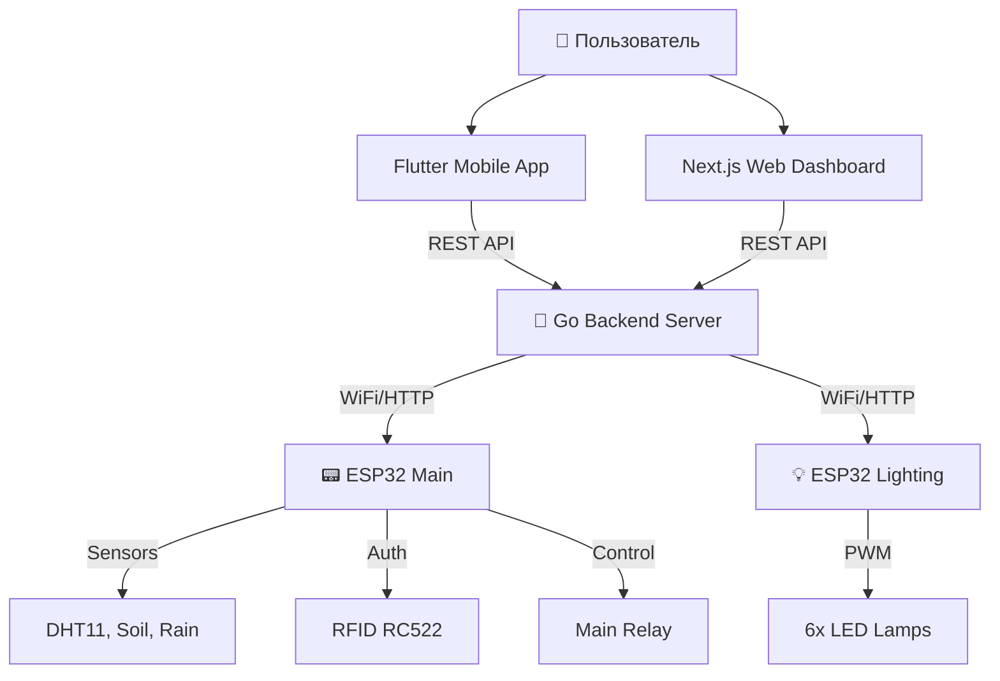

# 🏠 Smart Home IoT System


Профессиональная система умного дома с распределенной архитектурой, включающая два микроконтроллера ESP32, мощный Backend на Go, современный веб-интерфейс на Next.js и кроссплатформенное мобильное приложение на Flutter.

---

## 🏗️ Архитектура Системы

Система построена на микросервисной архитектуре с четким разделением обязанностей:



### 🧩 Компоненты

1.  **🚀 Backend (Go)**: Центральный мозг системы. Обрабатывает запросы, хранит историю данных в JSON, управляет логикой безопасности и погодными данными.
2.  **📱 Mobile App (Flutter)**: Красивое приложение для Android/Windows с управлением в реальном времени, настройками безопасности и мониторингом.
3.  **💻 Web Dashboard (Next.js)**: Стильный "Glassmorphism" интерфейс для управления домом из браузера.
4.  **📟 ESP32 #1 (Sensor Hub)**: Отвечает за сбор данных (климат, почва), управление главным реле и контроль доступа (RFID).
5.  **💡 ESP32 #2 (Lighting Hub)**: Выделенный контроллер для управления освещением (6 зон).

---

## ✅ Реализованный Функционал

### 🌡️ Мониторинг Климата
- **Температура и Влажность**: Сбор данных с DHT11 в реальном времени.
- **Влажность Почвы**: Аналоговый мониторинг состояния растений.
- **История**: Графики изменений и экспорт данных в Excel.

### 💡 Умное Освещение
- **6 Независимых Зон**: Управление каждой лампой отдельно.
- **Групповое Управление**: Включить/Выключить всё одной кнопкой.
- **Синхронизация**: Мгновенное обновление статуса на всех устройствах.

### 🛡️ Безопасность и Доступ
- **RFID Система**: Вход по картам доступа (Mifare).
- **Управление Картами**: Добавление и удаление карт через приложение.
- **Журнал Доступа**: История входов с указанием времени и UID карты.
- **Главное Реле**: Удаленное управление питанием.

### ⚡ Энергомониторинг (Симуляция)
- **Солнечные Панели**: Визуализация генерации энергии, напряжения и эффективности.

---

## 🚀 Как Запустить Проект

### 1. Backend (Сервер)
```bash
cd GolandProjects/awesomeProject
go run main.go
# Сервер запустится на http://192.168.x.x:8080
```

### 2. Веб-интерфейс
```bash
cd frontend
npm install
npm run dev
# Откройте http://localhost:3000
```

### 3. Мобильное Приложение
```bash
cd homesass
flutter run
# Выберите устройство (Android Emulator или Windows)
```

### 4. Прошивка ESP32
*   **ESP 1 (Сенсоры):** Загрузить прошивку из папки `esp32/` (используя PlatformIO).
*   **ESP 2 (Свет):** Загрузить прошивку из папки `esp2/`.

---

## 🔮 План Развития (Roadmap)

Мы не останавливаемся на достигнутом! Вот что планируется реализовать в ближайшем будущем:

- [ ] **📈 Advanced Analytics**: Внедрение базы данных (PostgreSQL/InfluxDB) для долговременного хранения статистики.
- [ ] **🤖 AI Automation**: Автоматическое управление светом на основе привычек пользователя (Machine Learning).
- [ ] **🔔 Push-уведомления**: Оповещения на телефон при срабатывании датчиков или входе по RFID.
- [ ] **🗣️ Голосовое Управление**: Интеграция с Алисой / Google Assistant.
- [ ] **📹 Видеонаблюдение**: Подключение ESP32-CAM для трансляции видеопотока в приложение.
- [ ] **🌤️ Погодная Станция**: Интеграция внешних API погоды для автоматического полива.

---

<div align="center">

**Developed with ❤️ by [Terentii Iulian]**

🌟 Star this repo if you like it!

</div>
