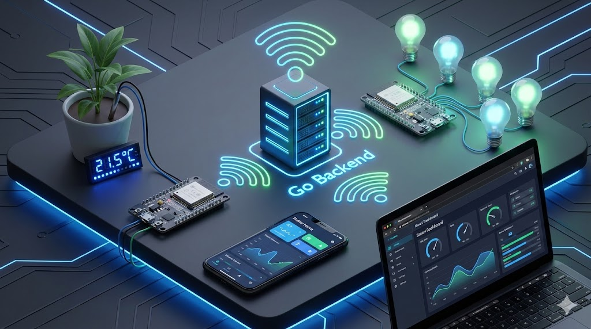
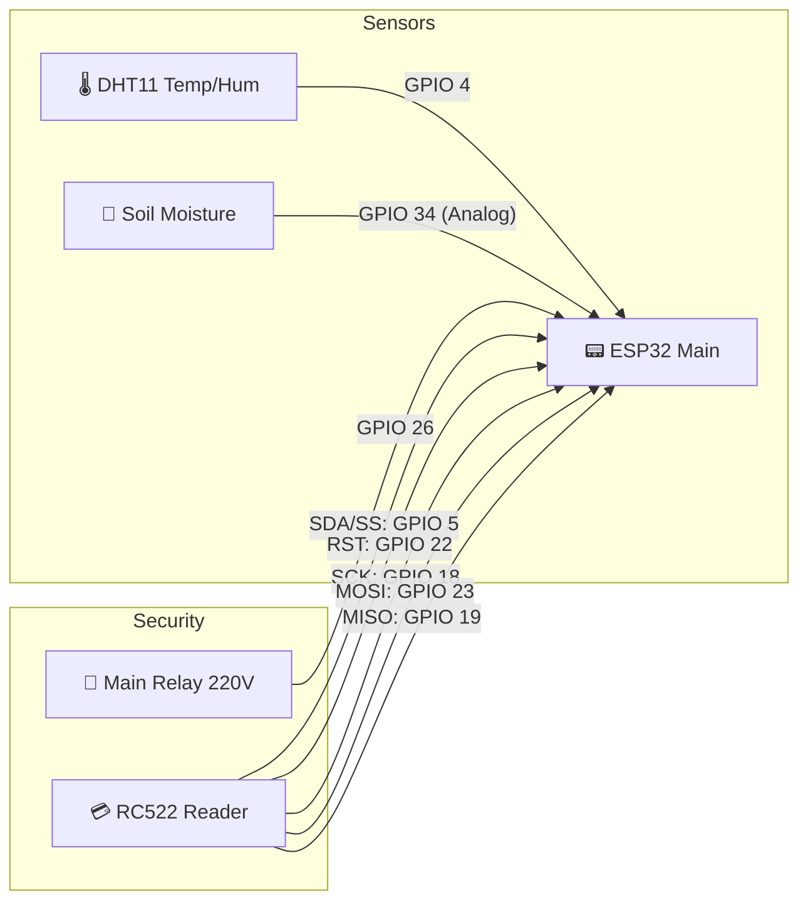
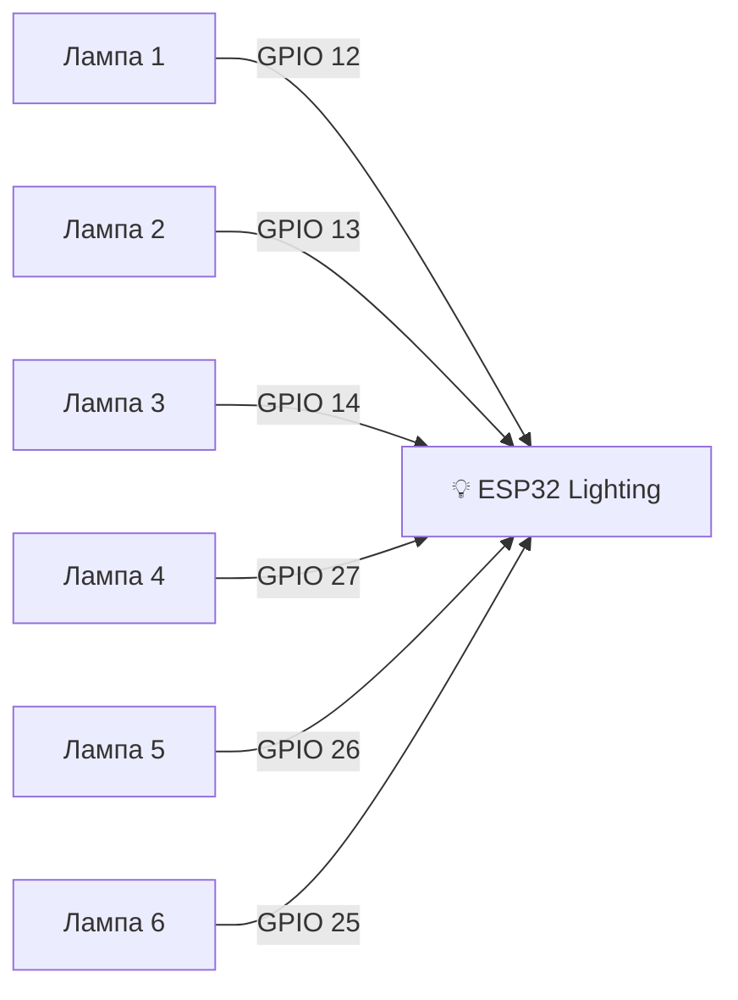

# 🏠 Smart Home IoT System

Профессиональная, масштабируемая экосистема умного дома. Проект демонстрирует полный цикл разработки IoT: от низкоуровневого программирования микроконтроллеров до высоконагруженного Backend-сервера и кроссплатформенных клиентских приложений.

---

## 🔌 Схема Подключения (Hardware Wiring)

Система разделена на два физических узла для распределения нагрузки и удобства монтажа.

### 📟 Узел 1: Сенсоры и Безопасность (ESP32 Main)
Этот контроллер отвечает за входную группу, климат и безопасность.

### 💡 Узел 2: Освещение (ESP32 Lighting)
Этот контроллер управляет 6-ю зонами освещения в доме.

> **Важно:** Все светодиоды/лампы должны подключаться через токоограничивающие резисторы (220 Ом) или через MOSFET-транзисторы, если управляется нагрузка 12V/220V.

---

## 📅 История Реализации (Development Journey)

Проект развивался итеративно. Вот список выполненных работ:

### Этап 1: Фундамент (MVP)
- [x] Развертывание **Backend на Go (Gin)**: Создана архитектура REST API.
- [x] Создание **Flutter приложения**: Базовый UI для мониторинга.
- [x] Подключение **ESP32 #1**: Чтение DHT11 и отправка JSON на сервер.

### Этап 2: Расширение и UI
- [x] **Web Dashboard (Next.js)**: Реализован "Glassmorphism" дизайн.
- [x] **Синхронизация**: Внедрено обновление данных в реальном времени (Polling).
- [x] **Weather API**: Интеграция OpenWeatherMap для получения прогноза погоды.

### Этап 3: Безопасность и RFID
- [x] **RFID Auth System**: Подключен модуль RC522.
- [x] **База Данных Карт**: Реализовано хранение разрешенных UID в `cards.json`.
- [x] **Интеллектуальный Вход**: При сканировании карты сервер проверяет права и включает свет.
- [x] **UI Управления Доступом**: Добавлены экраны добавления/удаления карт в приложении и на сайте.

### Этап 4: Масштабирование (Dual ESP)
- [x] **Разделение Логики**: Переход от одного ESP32 к архитектуре из двух контроллеров.
- [x] **Lighting API**: Создан отдельный канал связи для синхронизации ламп между сервером и ESP #2.

---

## 🐛 Преодоленные Трудности (Challenges & Fixes)

В ходе разработки мы столкнулись с рядом интересных технических проблем:

| Проблема (Bug) | Причина | Решение |
|----------------|---------|---------|
| **"Призрак старого IP"** | Приложение Flutter кэшировало старый IP (`192.168.100.229`) и игнорировало изменения в конфиге. | Внедрена принудительная проверка при старте: если найден старый IP, он автоматически перезаписывается на актуальный. |
| **Race Condition в Go** | Одновременная запись данных от ESP и чтение клиентом приводили к падению сервера (`concurrent map write`). | Использованы `sync.Mutex` (`mu.Lock/Unlock`) для защиты всех операций с глобальными переменными. |
| **Шрифты на Android** | `GoogleFonts` не загружались на эмуляторе без интернета, вызывая краш приложения. | Добавлен фоллбэк на системный шрифт `monospace` при ошибке загрузки. |
| **Рассинхрон UI** | При включении лампы UI обновлялся локально, но вложенный объект `data` оставался старым. | Полное обновление дерева состояния в провайдере Flutter при любом действии. |
| **Next.js Proxy Error** | Встроенный прокси Next.js некорректно обрабатывал локальные IP в некоторых сетях. | Переход на прямые запросы к Go-серверу с включением CORS (`Access-Control-Allow-Origin: *`). |

---

## 🔮 План Развития (Roadmap)

- [ ] **📈 База Данных**: Миграция с JSON-файлов на PostgreSQL.
- [ ] **🤖 AI Automation**: Автоматическое выключение света, если в комнате нет движения 30 минут.
- [ ] **🔔 Push-уведомления**: Firebase Cloud Messaging для оповещений о взломе/входе.
- [ ] **🗣️ Голосовое Управление**: Интеграция с Алисой / Google Assistant.

---

**Developed with ❤️ by [Terentii Iulian]**

🌟 Star this repo if you like it!

